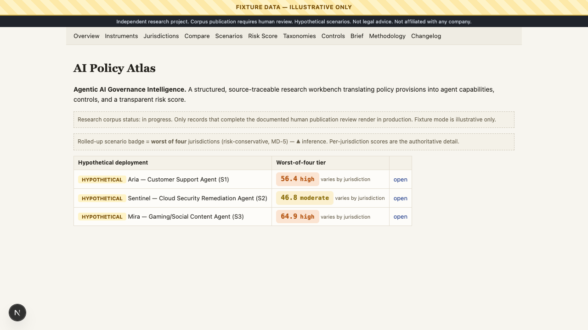
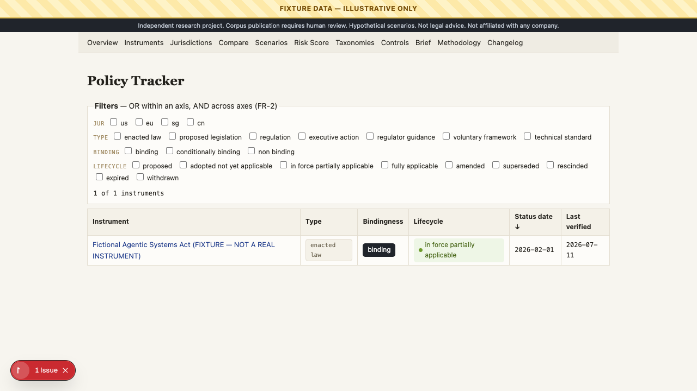
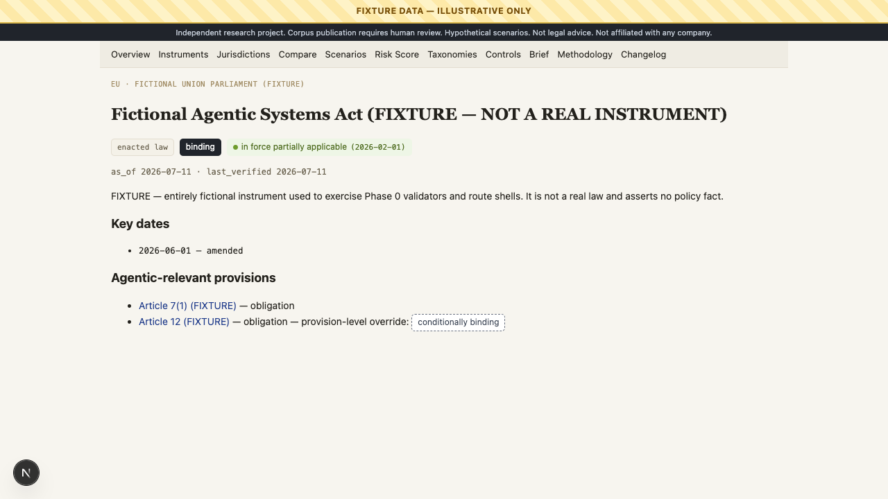
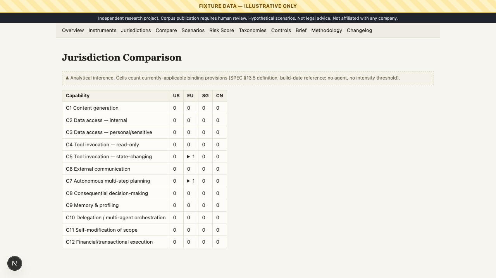
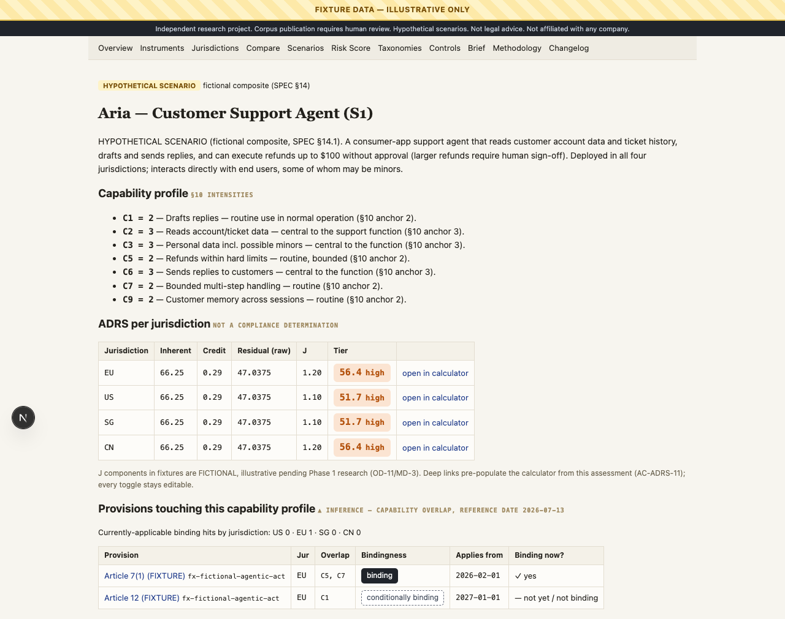
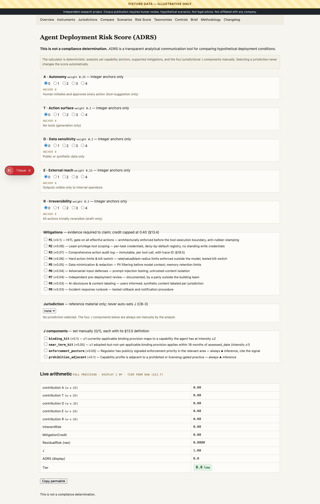
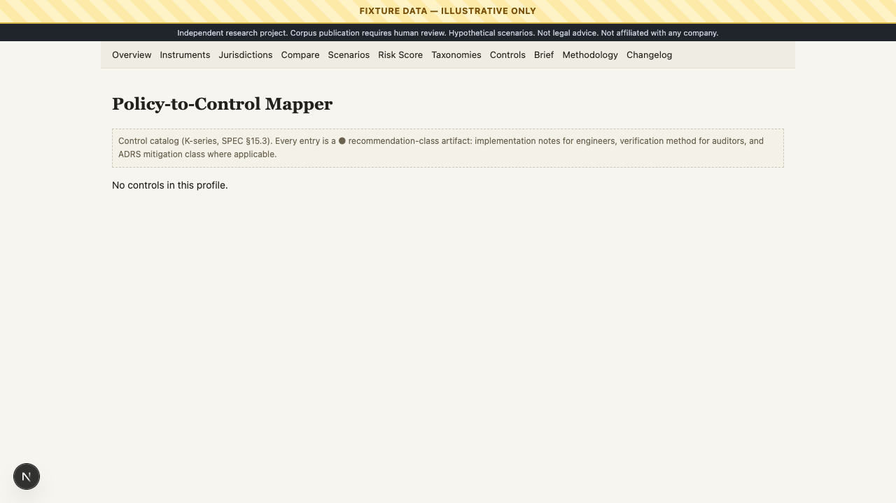
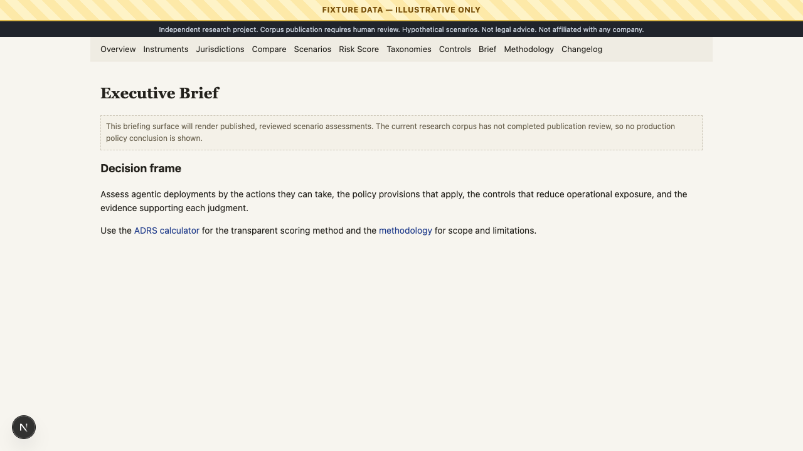

# AI Policy Atlas

**Agentic AI Governance Intelligence** — an independent, source-traceable research product that translates policy provisions into agent capabilities, engineering controls, and a transparent risk score.

> Current verdict: **CODE READY, CONTENT NOT READY.** The fixture demo is runnable. The real policy corpus remains `in_review`; no unreviewed policy analysis renders in production.



## Why this project exists

Agentic systems read and write data, call tools, communicate externally, and take multi-step actions. Governance teams need an evidence chain from policy text to concrete system controls without treating every document as an equivalent legal obligation.

The core question is: **how can a global organization compare the governance implications of the same agentic capability across jurisdictions while keeping conclusions source-traceable and epistemically honest?**

## Method and ADRS

The Atlas classifies policy instruments by type, bindingness, lifecycle, and regulatory approach; maps relevant provisions to agentic capabilities and governance risks; and maps those to technical and organizational controls.

`ADRS = min(100, InherentRisk × (1 − MitigationCredit) × J)`

ADRS is a communication and prioritization tool, **not** a legal determination or compliance certification. See [methodology](docs/METHODOLOGY_DECISIONS.md).

## Fixture vs. production modes

| Mode | Content | Purpose | Deployment status |
|---|---|---|---|
| `fixtures` | Explicitly fictional scenarios and records | Demo, interaction tests, design review | Never deploy |
| `production` | Real research records only | Publication-gated delivery | Code path ready; corpus has zero published records |

Production selection is fail-closed: it excludes `fixture:true` data and rejects every record whose `review_status` is not `published`. The reconciled corpus contains 17 sources, 15 instruments, 9 provisions, 13 controls, 10 control mappings, and 2 changelog records; every reviewable record remains `in_review`. See [publication readiness](docs/research/PUBLICATION_READINESS_REPORT.md) and the [corpus inventory](docs/research/CORPUS_INVENTORY.md).

## Current implementation status

- Production and fixture datasets are isolated and covered by automated checks.
- Core pages, taxonomies, jurisdiction pages, bibliography, glossary, about, downloads, and ADRS routes are implemented.
- Fixture dashboard, tracker, instrument detail, comparison, scenario, calculator, controls, and brief are browser-tested.
- Production correctly renders an empty published-corpus state until human review is complete.
- Publication workflow, reviewed scenario assessments, and final export PDFs remain open work.

## Screens

| Dashboard | Policy tracker | Instrument detail | Comparison |
|---|---|---|---|
|  |  |  |  |

| Scenario detail | Risk score | Policy-to-control mapper | Executive brief |
|---|---|---|---|
|  |  |  |  |

## Setup and scripts

```bash
npm ci
npm run dev
npm run validate:fixtures
npm run build:fixtures
npm run test:e2e
```

| Command | What it verifies |
|---|---|
| `npm run lint` | Static linting |
| `npm run typecheck` | TypeScript correctness |
| `npm run test` | ADRS, schemas, and validation tests |
| `npm run test:integration` | Dataset/profile/integrity pipeline |
| `npm run test:e2e` | Fixture demo browser flows |
| `npm run test:e2e:production` | Production empty-state and fixture-exclusion UI |
| `npm run validate:fixtures` | Illustrative corpus integrity |
| `npm run build:fixtures` | Fixture static build |
| `npm run validate:production` | Publication gate; currently fails because content is `in_review` |
| `npm run build:production` | Run only after publication validation passes |

## Route map

`/` · `/instruments` · `/jurisdictions` · `/compare` · `/scenarios` · `/risk-score` · `/taxonomy/policy` · `/taxonomy/capabilities` · `/taxonomy/risks` · `/controls` · `/methodology` · `/bibliography` · `/glossary` · `/about` · `/downloads` · `/executive-brief`

Legacy paths `/calculator`, `/policies`, and `/brief` permanently redirect to canonical routes. See [route compliance](docs/ROUTE_COMPLIANCE_REPORT.md).

## Source integrity and limitations

- Facts, inferences, and recommendations are stored separately.
- Facts require Tier 1 or Tier 2 citations; Tier 1 sources require archive or manual-verification evidence.
- Every instrument and provision carries `as_of_date` and `last_verified`.
- The corpus is curated, not comprehensive; it is neither real-time monitoring nor legal advice.
- Chinese-language source material is cited in its authoritative language; translations remain explicitly bounded by the methodology.

## Interview demo flow

1. Open the fixture profile and point out the persistent illustrative-data banner.
2. Use the tracker to distinguish a policy instrument’s type, bindingness, and lifecycle.
3. Open a provision to follow Fact → Inference → Recommendation.
4. Show the policy-to-control mapper and the ADRS calculator’s manual inputs.
5. End at [publication readiness](docs/research/PUBLICATION_READINESS_REPORT.md): explain why the real corpus is withheld until human review.

## Repository structure

- `src/app/` — Next.js App Router pages
- `src/components/` — semantic UI and interactive calculator/tracker
- `src/data/fixtures/` — explicitly fictional demo corpus
- `src/data/content/` — real research corpus, publication-gated
- `src/lib/` — ADRS, schemas, validation, applicability
- `e2e/` — browser tests for fixture and production profiles
- `docs/research/` — publication review artifacts
- `design/screenshots/` — reviewer-facing visual evidence

## Roadmap

1. Complete and document independent human review for every queued record.
2. Promote only approved records with an auditable review trail.
3. Add reviewed production scenario assessments and executive brief.
4. Re-run `validate:production`, `build:production`, and production browser checks.
5. Generate final PDF/CSV/JSON exports from published data.

## Disclaimer

AI Policy Atlas is an independent research project. It is not legal advice, does not certify compliance, and is not affiliated with or representative of any company or government body.
