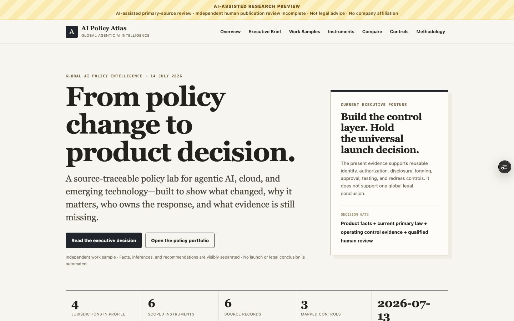
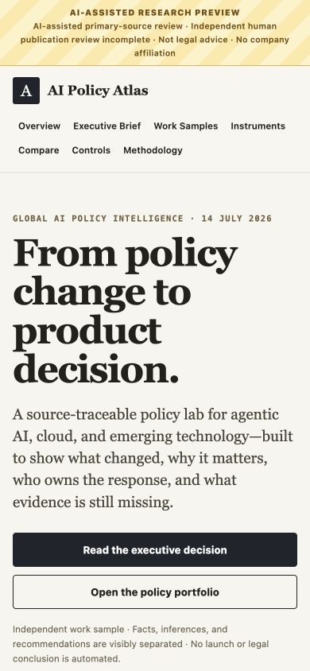
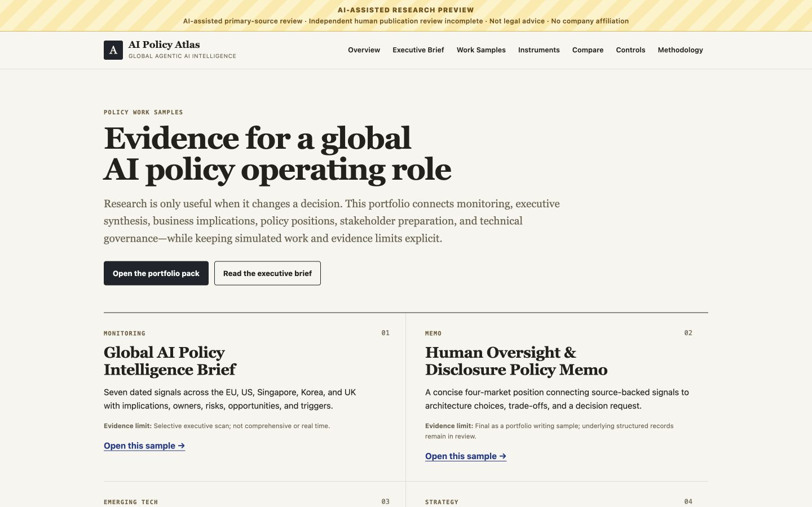
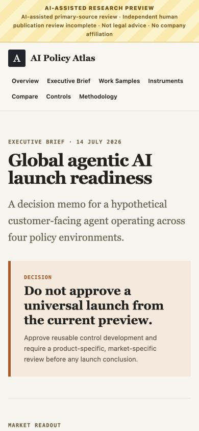

# Portfolio QA Report — 2026-07-14

**Release surface:** Tencent Associate, Global AI Policy hiring-manager portfolio

**Hosted profile:** Vercel Preview, `BUILD_PROFILE=preview`

**Verified URL:** <https://ai-policy-atlas-ax2183-5057-ao-xus-projects.vercel.app>

**Evidence boundary:** this report verifies the application and portfolio delivery. It does not convert `in_review` policy records into approved publications or provide legal review.

## Outcome

The role-facing portfolio, generated artifacts, preview data, builds, live routes, responsive layouts, and downloads passed the release checks below. The production publication gate failed for the intended and documented reason: no instrument has independent approval and `review_status: published`.

## Local verification matrix

| Check | Result | Evidence |
|---|---|---|
| ESLint | Pass | No lint errors |
| TypeScript | Pass | `tsc --noEmit` completed without errors |
| Unit tests | Pass | 31 / 31 |
| Integration tests | Pass | 36 / 36, including publication-gate and portfolio-source governance |
| Fixture validation | Pass | Schema and integrity checks passed |
| Preview validation | Pass | Preview, portfolio, and corpus-analysis exports current; scoped integrity passed |
| Fixture build | Pass | Next.js compiled, type-checked, and generated 33 static pages |
| Preview build | Pass | Next.js compiled, type-checked, and generated 35 static pages |
| Production validation | Expected fail | Exactly one error: `R8-publication-empty`; build aborted before presenting an empty research base as publication-ready |
| Markdown relative links | Pass | 89 Markdown files checked; no missing relative targets |
| App download targets | Pass | All 24 app-referenced download assets exist |
| Stakeholder JSON | Pass | Canonical and public copies parse successfully |
| Export reproducibility | Pass | `check:preview-exports`, `check:portfolio-exports`, and `check:corpus-analysis` pass |

The browser E2E files were updated to cover the expanded portfolio, but standalone Playwright was not run because this release used the user-approved in-app browser surface. No automated-browser result is claimed.

## Executive deck QA

| Check | Result |
|---|---|
| Presentation opens and renders | Pass |
| Slide count | 6 |
| Automated overflow test | Pass; no overflow detected |
| Visual review | Pass; all six rendered slides inspected individually and as a montage |
| Public asset | HTTP 200 with PowerPoint MIME type |

The deck is an editable independent portfolio sample. It does not claim an internal presentation, an external audience, or company adoption.

## Vercel deployment

| Field | Result |
|---|---|
| Project | `ai-policy-atlas` |
| Target | Preview |
| Status | Ready |
| Build profile | Preview |
| Remote validation | Preview exports, portfolio exports, corpus analysis, and integrity checks passed in the Vercel build |

The stable Preview alias resolves to the upgraded portfolio. Production was not promoted because the structured publication corpus does not satisfy the human-review gate.

## Live browser verification

The deployed site was opened in the in-app browser and checked at desktop and mobile breakpoints.

| Live check | Result |
|---|---|
| Home | Correct H1, visible AI-assisted research banner, 4 jurisdictions / 6 instruments / 6 sources / 3 controls, no horizontal overflow |
| Executive brief | Correct decision banner, market table present, no mobile overflow |
| Work samples | 13 cards, 13 unique primary sample links, 1 stakeholder secondary link, no desktop overflow |
| Downloads | 24 visible download rows |
| Instruments, comparison, and GDPR Article 22 | Rendered with the preview boundary |
| Primary home CTA | Navigated to `/executive-brief` and displayed the correct H1 |
| Browser console | No warnings or errors in the verified session |

Seven key routes returned HTTP 200. All 24 files under `public/downloads/` returned HTTP 200 from Vercel, including the `.pptx`, Markdown, JSON, and CSV artifacts with appropriate content types.

## Visual evidence

### Live desktop home

### Live mobile home

### Live desktop work-sample page

### Live mobile executive brief

## Residual limits

- The structured corpus is deliberately smaller than the future research-program target.
- No record is independently approved for production publication.
- External submissions, stakeholder relationships, multiweek monitoring cadence, cross-functional delivery, and business outcomes are not claimed.
- The Vercel surface is a non-production hiring-manager Preview and remains `noindex`.

## Release decision

**Approve the upgraded hiring-manager Preview for sharing. Do not promote the structured research corpus to Production.**
